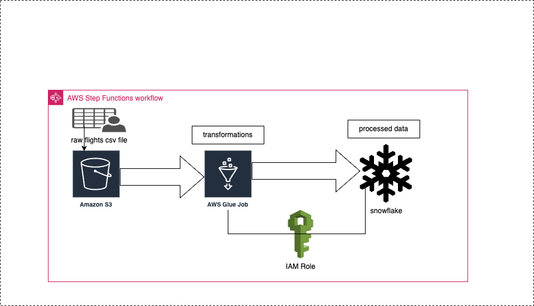

# Airline Data Ingestion Pipeline

This project contains a data pipeline for ingesting and processing flight data, filtering flights with significant delays. The pipeline is designed to automatically trigger when new flight data files are uploaded to an S3 bucket, process the data with AWS Glue, and store the final results in a Snowflake table.

## Overview

The pipeline is composed of the following components:

- **S3 Bucket**: Stores incoming flight data in a structured format.
- **AWS Glue**: A serverless ETL service that processes the incoming data and filters out flights with delays above a certain threshold.
- **Snowflake**: A cloud data warehouse where the final processed data is stored for analysis and reporting.

## Architecture

- Flight data is continuously uploaded to an S3 bucket.
- AWS Glue jobs are triggered automatically when a new file is created in the S3 bucket.
- The Glue job processes the data and applies transformations to filter out flights with significant delays.
- The filtered data is loaded into a Snowflake table for further analysis.

## Components

### 1. S3 Bucket

- The S3 bucket serves as the data source.
- Data is uploaded in CSV/JSON format (customize based on your actual data format).

### 2. AWS Glue Job

- Glue jobs are responsible for transforming the raw flight data.
- Data filtering logic is applied to select flights with delays beyond a specific threshold.
- Transformations and cleaning steps are applied to the raw data before loading it to Snowflake.

### 3. Snowflake Table

- The final, transformed data is stored in Snowflake.
- Data is structured for efficient querying and reporting.

## Setup Instructions

### 1. Set Up S3 Bucket

- Create an S3 bucket in your AWS account.
- Upload your incoming flight data files to this bucket.

### 2. AWS Glue Setup

- Create an AWS Glue Job:
  - Specify the data source (S3 Bucket).
  - Write the transformation logic to filter delayed flights.
  - Set the output location to your Snowflake instance (using appropriate connectors).

### 3. Snowflake Configuration

- Set up a Snowflake database and table for storing the transformed flight data.
- Ensure that your Glue job has the necessary credentials to write to Snowflake.

### 4. Triggering Glue Jobs

- Set up an event trigger in S3 that activates the Glue job whenever a new file is uploaded.

